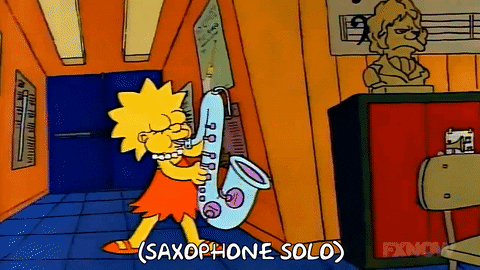
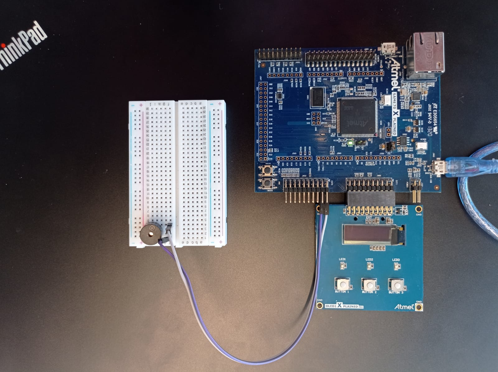

### 21a-emb-aps1
 

<h2> BUZZER + SAME70 = Um Musical! 🎷️</h2>

 

  </img>

 

### 📑️ Documentação 
 

| Função  |      PINOS      |
|---------|-----------------|
| BUZZER  |      PC13       |
| START   |      PD28       |
| SELEÇÃO |      PC31       |
| INICIO  |      PA19       |
| LED1    |      PA0        |
| LED2    |      PC30       |
| LED3    |      PB2        |
 

O projeto possui as seguintes pastas e arquivos relevantes para o entendimento do trabalho:

-`firmware/src/main.c` : Arquivo que contém a função main do código. Demais arquivos estão referenciados e importados nesse registro.

-`firmware/src/configurações.h`: Arquivo que contém defines e protótipos de funções do arquivo main.c.

-`firmware/src/leds.h` e `firmware/src/leds.c` : Arquivo de definiçõe e protótipos de funções e arquivo que contém funções reponsáveis pela "ativação" dos leds.

-`firmware/src/display.h` e `firmware/src/display.c` : Arquivo de definiçõe e protótipos de funções e arquivo que contém funções reponsáveis pela interação com o display OLED.

-`firmware/src/musicas.h` e`firmware/src/musicas.c` :  Arquivo de definiçõe e protótipos de funções e  arquivo que contém funções reponsáveis pelos tons tocados pelo buzzer. 

-`firmware/src/melodias` : Pasta que contém arquivos .h com defines de tons e array de melodia da música. 

-`firmware/src/ASF` , `firmware/src/config` , `firmware/src/oled` , `firmware/src/asf.h` : configurações gerais. 
  

### 🏗️ Montagem 

  </img>

  

Materiais necessários:

- Placa SAME 70 X PLAINED 

- Placa OLED1

- Protoboard

- Buzzer 

- Jumpers

Link para <b>vídeo do projeto funcionando</b>: [Clique Aqui](https://youtube.com/shorts/ZrKetDQtF9A)

 

### ⚙️ Configurações e Código 
 

Para o correto funcionamento é necessário que se esteja no sistema operacional Windows, caso esteja em Linux/Mac é necessário o uso de maquina virtual com  Windows 10 instalado. Nesse último caso,  recomenda-se fortemente o uso de [VMWARE PLAYER](https://www.vmware.com/products/workstation-player.html) como máquina virtual.

É necessário também a instalação do Software: [Microchip Studio](https://www.microchip.com/content/dam/mchp/documents/parked-documents/as-installer-7.0.2542-web.exe).

Por fim, com o circuito montado e conectado ao computador abra o projeto no Microchip Studio, rode o projeto e divirta-se!
  

###  📌️ Agradecimentos

Todas as músicas utilizadas nesse projeto foram retiradas do repositório [ArguinoSongs](https://github.com/robsoncouto/arduino-songs). 

Agradecimento especial ao usuário dono do repositório [robsoncouto](https://github.com/robsoncouto).

Músicas utilizadas :

- [Asa branca](https://github.com/robsoncouto/arduino-songs/blob/master/asabranca/asabranca.ino)

- [DOOM](https://github.com/robsoncouto/arduino-songs/blob/master/doom/doom.ino) 

- [Game of Thrones](https://github.com/robsoncouto/arduino-songs/blob/master/gameofthrones/gameofthrones.ino)

- [Harry Potter](https://github.com/robsoncouto/arduino-songs/blob/master/harrypotter/harrypotter.ino)

- [Mario](https://github.com/robsoncouto/arduino-songs/blob/master/supermariobros/supermariobros.ino)

- [Pacman](https://github.com/robsoncouto/arduino-songs/blob/master/pacman/pacman.ino)

- [Star Wars](https://github.com/robsoncouto/arduino-songs/blob/master/starwars/starwars.ino)

- [The God Father](https://github.com/robsoncouto/arduino-songs/blob/master/thegodfather/thegodfather.ino)

- [Zelda](https://github.com/robsoncouto/arduino-songs/blob/master/zeldatheme/zeldatheme.ino)
 

Repositório da disciplina do projeto : [Computacao Embarcada](https://insper.github.io/ComputacaoEmbarcada/)

@2022, Insper. Quinto Semestre, Engenharia da Computação.
